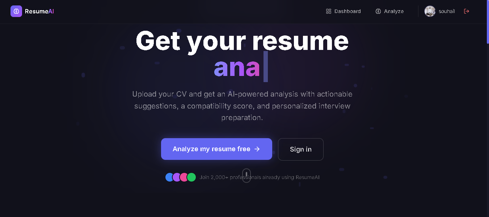
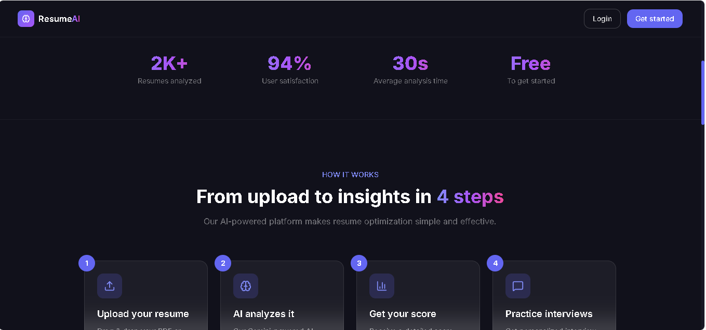
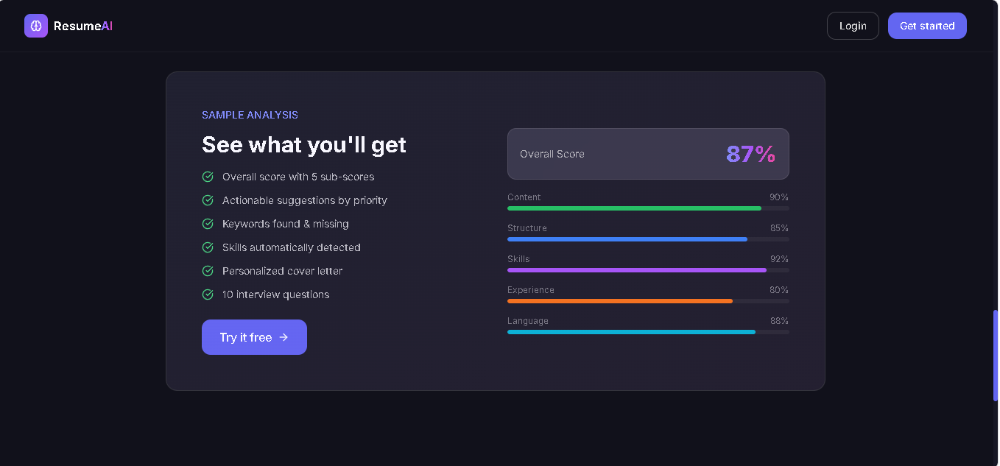
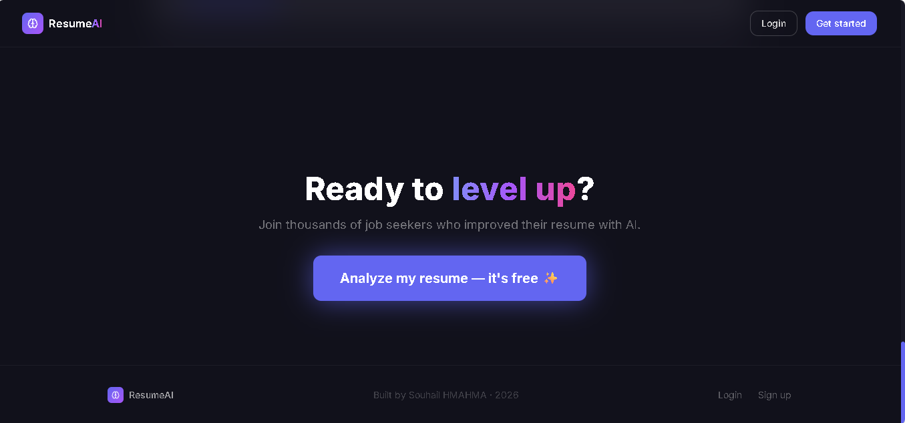
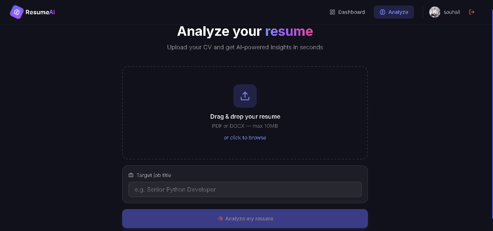
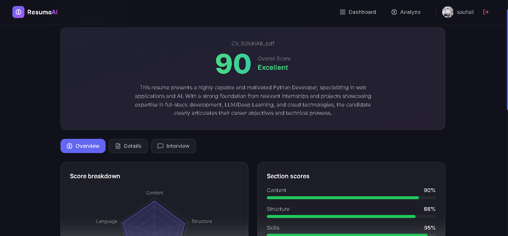
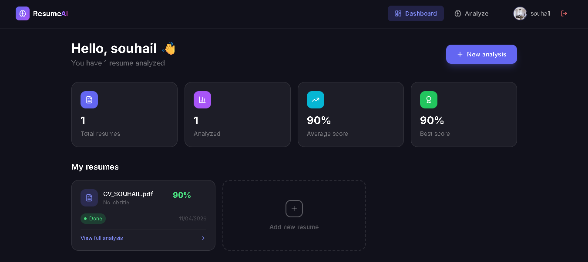
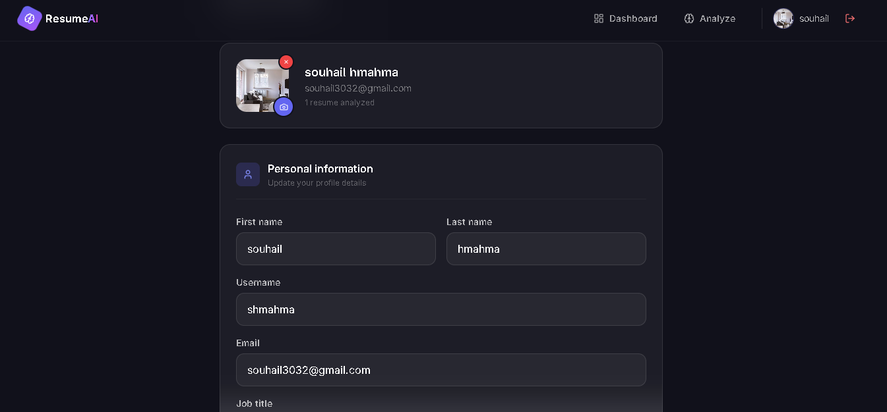
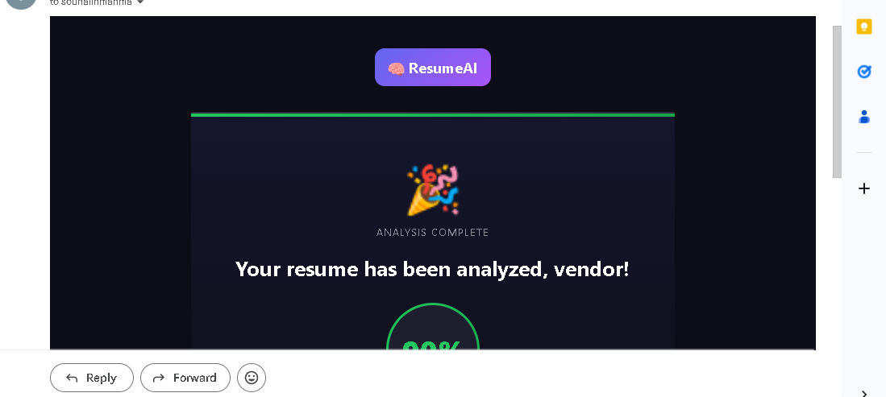

# 🧠 ResumeAI — AI-Powered Resume Analyzer

An intelligent resume analysis platform powered by Google Gemini AI. Upload your CV and get a detailed score, actionable suggestions, a personalized cover letter, and interview preparation — all in seconds.

> **Stack** : Django · DRF · React · PostgreSQL · Redis · Celery · Google Gemini AI

🌐 **Live demo** : [https://your-app-url.com](https://your-app-url.com)

---

## 📸 Screenshots

### Landing page
<!-- Replace with your production URL -->






### Resume upload
<!-- Replace with your production URL -->


### Analysis results
<!-- Replace with your production URL -->


### Dashboard
<!-- Replace with your production URL -->


### Cover letter generation
<!-- Replace with your production URL -->


### Interview preparation
<!-- Replace with your production URL -->


### Profile page
<!-- Replace with your production URL -->


---

## ✨ Features

### 🎯 AI Resume Analysis
- Upload PDF or DOCX resume (up to 10MB)
- Google Gemini AI analyzes every section
- Detailed score across 6 dimensions with animated radar chart
- Strengths and weaknesses breakdown
- Actionable suggestions sorted by priority (high / medium / low)

### 📊 Scoring System
```
Content     → Quality and relevance of content
Structure   → Organization and formatting
Skills      → Technical and soft skills presence
Experience  → Work experience quality
Language    → Grammar, clarity, professional tone
Overall     → Weighted average of all sections
```

### ✍️ Cover Letter Generator
- AI-generated personalized cover letter
- Tailored to specific company and position
- Copy to clipboard in one click
- Regenerate as many times as needed

### 🎤 Interview Preparation
- 10 personalized interview questions based on your resume
- 4 categories: Technical, Behavioral, Experience, Situational
- Difficulty levels: Easy / Medium / Hard
- Answer textarea to practice responses
- Hints for each question

### 📧 Email Notifications
- Styled HTML welcome email on registration
- Analysis complete notification with score
- Color-coded score display in email


---

## 📡 API Endpoints

### Auth — `/api/auth/`

| Method | Endpoint | Description | Access |
|---|---|---|---|
| `POST` | `/register/` | Create account | Public |
| `POST` | `/login/` | Login → JWT tokens | Public |
| `POST` | `/token/refresh/` | Refresh access token | Public |
| `GET` | `/me/` | Get current user | Authenticated |
| `PATCH` | `/profile/` | Update profile | Authenticated |
| `POST` | `/change-password/` | Change password | Authenticated |
| `DELETE` | `/avatar/delete/` | Remove avatar | Authenticated |
| `DELETE` | `/delete/` | Delete account | Authenticated |

### Resumes — `/api/resumes/`

| Method | Endpoint | Description | Access |
|---|---|---|---|
| `GET` | `/resumes/` | List my resumes | Authenticated |
| `POST` | `/resumes/upload/` | Upload resume | Authenticated |
| `GET` | `/resumes/<id>/` | Resume detail | Authenticated |
| `DELETE` | `/resumes/<id>/` | Delete resume | Authenticated |
| `GET` | `/resumes/<id>/status/` | Poll analysis status | Authenticated |

### Analysis — `/api/resumes/<id>/`

| Method | Endpoint | Description | Access |
|---|---|---|---|
| `GET` | `/analysis/` | Get full analysis | Authenticated |
| `POST` | `/analysis/regenerate/` | Re-run AI analysis | Authenticated |
| `POST` | `/cover-letter/` | Generate cover letter | Authenticated |
| `GET` | `/cover-letter/status/` | Poll cover letter status | Authenticated |
| `POST` | `/interview/` | Generate interview questions | Authenticated |
| `GET` | `/interview/status/` | Poll interview questions status | Authenticated |

---

## 🔄 How it works

```
1. User uploads PDF or DOCX
        ↓
2. Django extracts text (pdfplumber / python-docx)
        ↓
3. Celery sends task to Redis queue
        ↓
4. Gemini AI analyzes the text
        ↓
5. Scores + suggestions saved to PostgreSQL
        ↓
6. Email notification sent to user
        ↓
7. React polls status → redirects to results page
```


---

## 🧪 Test the app

```
1. Register at /register
2. Upload a PDF or DOCX resume at /analyze
3. Wait 10-30 seconds for analysis
4. View results at /results/:id
5. Generate cover letter and interview questions
```

---

## ⚙️ Local installation

```bash
# Backend
python -m venv venv
.\venv\Scripts\Activate
pip install -r requirements.txt
python manage.py migrate
python manage.py createsuperuser
python manage.py runserver

# Frontend
cd frontend
npm install
npm run dev

# Celery
celery -A config worker --loglevel=info --pool=solo
```

---

## 👤 Author

**Souhail HMAHMA** — Python Developer

🌐 [souhail3.vercel.app](https://souhail3.vercel.app) · 💼 [LinkedIn](https://linkedin.com/in/souhail-hmahma) · 🐙 [GitHub](https://github.com/souhmahma)